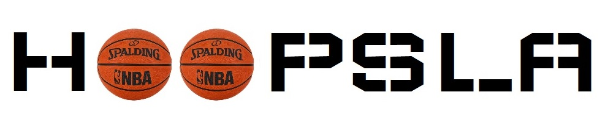

### Hi there 👋!
  Thank you for visiting my GitHub page.   My Name is Don Ark and I have worked in the technology field for well over 20 years.   I am currently an IT Manager looking to expand in other aspects of technology,  specifically coding! I look forward to the challenges of the vast world of coding and hopefully set my mark.  I am inquisitive and eager to learn.
  

### Skills Developed And Utilized

              

### Applications Developed

A full-stack medical application that allows users to select their body ailment and specify what symptoms they are experiencing in order to better diagnosis and suggest proper treatments. Developed using Javascript ES6, React, Node.js, Express, PostgreSQL, Bootstrap 4, CSS3, HTML5, npm, Webpack, Pgweb, Figma.

Live Preview: [Med-Self](https://med-self.herokuapp.com/)

# ---------------------------------------------

An simplistically styled basketball application to get you stats. Developed using HTML5, CSS3, JavaScript ES6, Bootstrap 4, AJAX, Figma.

Live Preview: [Hoopsla](https://donark1.github.io/hoopsla/)

# ---------------------------------------------

### :email: Contact Me:

don_ark@sbcglobal.net

### More About Me

LinkedIn Profile: [linkedin](https://www.linkedin.com/in/don-ark/)

My resume: [View](./DonArkResume.png)

<!--
**donark1/donark1** is a ✨ _special_ ✨ repository because its `README.md` (this file) appears on your GitHub profile.

Here are some ideas to get you started:

- 🔭 I’m currently working on ...
- 🌱 I’m currently learning ...
- 👯 I’m looking to collaborate on ...
- 🤔 I’m looking for help with ...
- 💬 Ask me about ...
- 📫 How to reach me: ...
- 😄 Pronouns: ...
- ⚡ Fun fact: ...
-->
